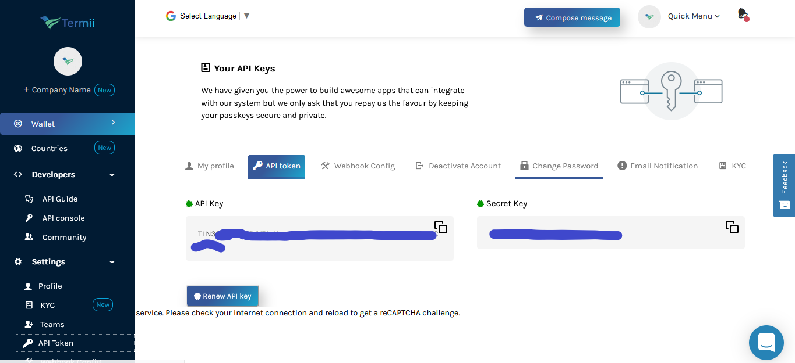

[](https://github.com/abduljeleelng/#readme) :joy: 💖


# [termii-nodejs-sdk](https://developers.termii.com/)
### Node js SDK for the Termii messages (SMS) and one time password (OTP) services
## Introduction
>  These docs will give you a deep dive into Termii Nodejs SDK full  API Reference Documentation and how to seamlessly integrate Termii messaging channels and verification functionalities into [NodeJS](https://nodejs.org/) application.
> For more details about the [Termii services](https://developers.termii.com/)

## Installation

Use need [NodeJS](https://nodejs.org/) or [yarn](https://yarnpkg.com) package manager to use this SDK with your nodejs application.
Note: all the instance return promise.

```bash
npm install abduljeleelng/termii-nodjs --save
```
or

```bash
yarn add abduljeleelng/termii-nodjs
```
# Get your api key
> create an account at [termii.com](termii.com).
> - login to your account
> - click on the setting
> - click on the API Token
> - copy your API Key
> - the image bellow can guid you more
     
>
>
# Basic
```bash
#
import Termii from "termii-nodejs-sdk"

#es5
const Termii = require("termii-nodejs-sdk")

#usage 
const termii = new Termii("your API Key")

#Get your account balance 
let balance = termii.balance(); #balance will return a promise
balance.then(data=>{
    console.log(JSON.stringify({data}))
})

#Or
termii.balance().then(data=>{console.log({data})}).catch(err=>{console.log({err})})

#Or
 (async () => {
     balance = await termii.balance();
     console.log(JSON.stringify({balance}))
 })()
 
 # Request for A token 
 termii.token({
    message_type: "NUMERIC",
    to: "2348037.........",
    from: "Token",
    channel: "generic",
    pin_attempts: 4,
    pin_time_to_live: 4,
    pin_length: 6,
    pin_placeholder: "< 123456 >",
    message_text: "Your (company name) confirmation code is < 123456 >. It expires in 30 minutes",
    "pin_type":"NUMERIC"
}).then(dat=>console.log({dat})).catch(er=>console.log({er}));
```

# Available Services
```
 #
import Termii from "termii-nodejs-sdk"

#es5
const Termii = require("termii-nodejs-sdk")

#usage 
const termii = new Termii("your API Key")
 ```

[`termii.getSenderId()` Get all the your available sender id ](docs/senderId.md)

[`termii.requestSenderId({sender_id,usecase,company})` Request for a new sender Id ](docs/requestSenderId.md)

[`termii.sendSMS({to,from,sms,type,channel,media})` Send SMS ]()

[`termii.bulkSMS({to,from,sms,type,channel})` Send bulk SMS ]()

[`termii.message({to,sms})` Send message | Number API ]()

[`termii.template({phone_number,device_id,template_id,data:{product_name,opt,expiry_time}})` Template ]()

[`termii.phoneBook()` Get phone book ]()

[`termii.createPhoneBook({phonebook_id,phonebook_name,description})` create phone book ]()
 
[`termii.updatePhoneBook({phonebook_id,phonebook_name,description})` update phone book ]()

[`termii.deletePhoneBook({phonebook_id})` Delete phone book ]()

[`termii.contact({phonebook_id})` get all the contact ]()

[`termii.addContact({phonebook_id,phone_number,country_code,email_address,first_name,last_name,company})` Add contact ]()

[`termii.addBulkContact({phonebook_id,contact_file,country_code})` Add bulk Contact ]()

[`termii.deleteContact({contact_id})` delete contact ]()

[`termii.campaign({country_code,sender_id,message,channel,message_type,phonebook_id,campaign_type,schedule_sms_status,schedule_time})` Campaign ]()

[`termii.campaignList()` Campaign List ]()

[`termii.campaignHistory({campaign_id})` Campaign Hostory ]()

[`termii.token({message_type,to,from,channel,pin_attempts,pin_time_to_live,pin_length,pin_placeholder,message_text})` Token | OTP ]()

[`termii.voiceToken({pin_type,phone_number,pin_attempts,pin_time_to_live,pin_length})` Voice Token]()

[`termii.callToken({phone_number,code})` call token | OTP ]()

[`termii.inAppToken({pin_type,phone_number,pin_attempts,pin_time_to_live,pin_length})` In App Token ]()

[`termii.verifyToken({pin_id,pin})` Verify Token ]()

[`termii.balance()` get account balance ]()

[`termii.search({phone_number})` search ]()

[`termii.status({ phone_number:", country_code:"})` status ]()

[`termii.history()` history ]()


## Report issues here 💔
[Termii nodejs SDK issue](https://github.com/abduljeleelng/termii-nodejs-sdk/issues)

## Documentation
[Termi services](https://termii.com)

## Todo 
- Create more sample to consume all the services 
- create more details in the documentation
- add more validation to the payload and response
- write an article about the services


## Contact Me
[Abduljeleel Yusuff]<mailto:abduljeleelng@gmail.com> 


